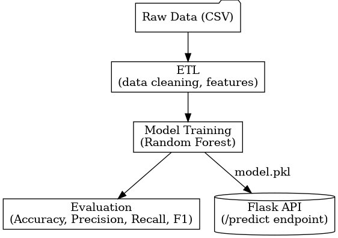

# Credit Scoring Pipeline (Week 2 - Part 1)

## 📌 Overview
This project implements a **credit scoring pipeline** with:
- ETL (data cleaning & feature preparation)
- Model training (Random Forest Classifier)
- Evaluation (Accuracy, Precision, Recall, F1)
- Deployment via **Flask API** (`/predict` endpoint)

This marks the completion of **Week 2, Part 1** in my AI Engineer Roadmap.

---

## ⚙️ Project Structure
part1-credit-scoring-pipeline/
├── data/
│ └── raw/credit_data.csv
├── models/
│ └── model.pkl
├── src/
│ ├── etl.py
│ ├── train.py
│ ├── evaluate.py
│ └── app.py
├── train.log
├── evaluate.log
└── README.md

  
Create virtual environment :
  
python -m venv .venv
source .venv/bin/activate   # Linux/Mac
.venv\Scripts\activate      # Windows

Install dependencies:
pip install -r requirements.txt

🧩 Usage
1. Run ETL
python src/etl.py

2. Train model
python src/train.py

3. Evaluate model
python src/evaluate.py

4. Start API
python src/app.py
Now API is running at: http://127.0.0.1:5000

📡 API Example
Request:
  
curl -X POST -H "Content-Type: application/json" \
-d '{"age": 35, "income": 50000, "loan_amount": 12000}' \
http://127.0.0.1:5000/predict

Response:

json
  
{"prediction": 0}

## 🏗️ Architecture Diagram

📖 Logs
Training log: train.log

Evaluation log: evaluate.log